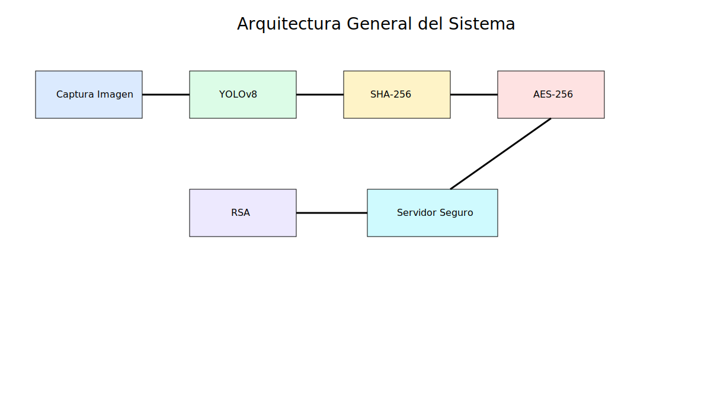
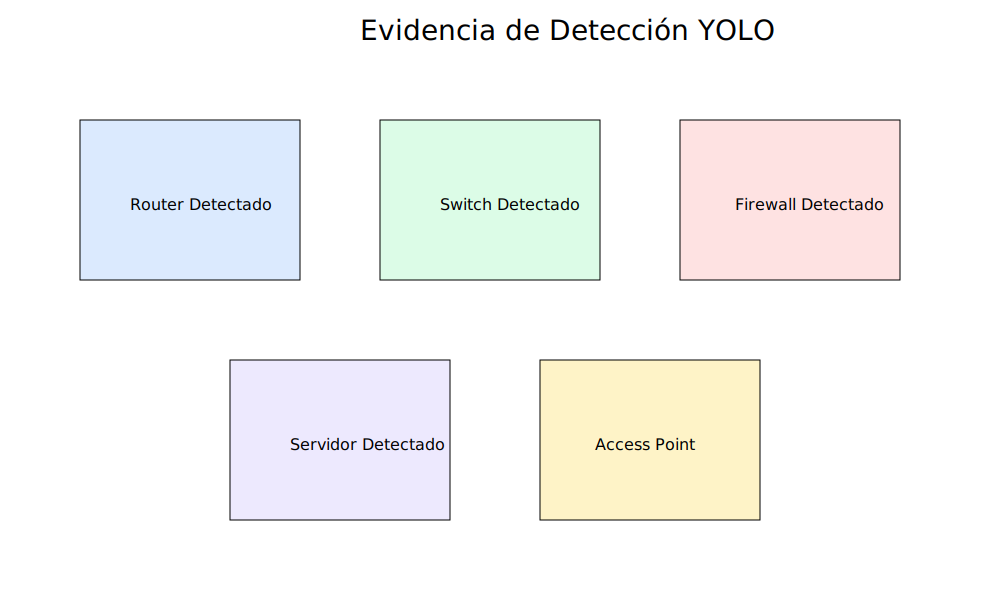
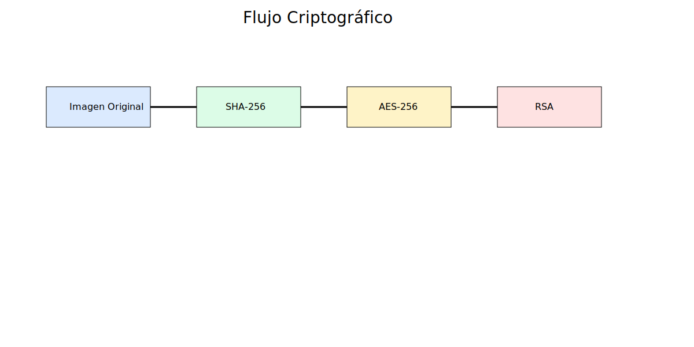

# Sistema de Inventario Visual y Auditoría de Seguridad para Telecomunicaciones

Proyecto Final de Seguridad de la Información aplicado a Ingeniería en Telecomunicaciones.

## Objetivo General

Desarrollar un sistema automatizado capaz de:

- Detectar activos de telecomunicaciones usando YOLOv8
- Proteger la información mediante criptografía
- Evaluar controles de seguridad ISO 27001

---

# Arquitectura del Proyecto



El sistema integra:

1. Captura de imágenes
2. Detección YOLO
3. Generación de metadatos
4. Hash SHA-256
5. Cifrado AES
6. Intercambio seguro RSA
7. Auditoría ISO 27001

---

# Módulo 1 - Detección de Activos con YOLO

## Objetivos

- Detectar dispositivos de telecomunicaciones
- Clasificar activos automáticamente
- Generar evidencia visual

## Clases entrenadas

- Router
- Switch
- Firewall
- Servidor
- Access Point

## Tecnologías utilizadas

- YOLOv8
- OpenCV
- Roboflow
- Python
- Ultralytics

## Dataset

El dataset fue estructurado utilizando carpetas de entrenamiento y validación.

Archivo:

```bash
dataset/data.yaml
```

## Evidencias



---

# Módulo 2 - Criptografía

## Objetivos

Proteger imágenes y metadatos antes de enviarlos al servidor de auditoría.

## Técnicas implementadas

### SHA-256

Garantiza integridad de la evidencia.

Archivo:

```bash
scripts/sha256_integrity.py
```

### AES-256

Protege imágenes y archivos.

Archivo:

```bash
scripts/aes_encrypt.py
```

### RSA

Protege la clave AES.

Archivo:

```bash
scripts/rsa_encrypt.py
```

## Flujo Criptográfico



---

# Módulo 3 - Auditoría ISO 27001

## Controles evaluados

| Control | Resultado |
|---|---|
| Inventario de activos | Cumple |
| Uso aceptable | Cumple |
| Transferencia segura | Cumple |
| Etiquetado visual | Cumple |
| Protección contra malware | Parcial |

## Documentos de auditoría

- docs/soa_iso27001.md
- docs/matriz_riesgos.md
- docs/auditoria_iso27001.md

---

# Matriz de Riesgos

| Riesgo | Nivel | Mitigación |
|---|---|---|
| Interceptación de imágenes | Alto | AES + RSA |
| Alteración de evidencia | Alto | SHA-256 |
| Malware | Alto | Antivirus |
| Robo de dispositivo | Crítico | Cifrado local |

---

# Simulación del Proyecto

## Flujo operativo

1. El técnico captura una imagen.
2. YOLO detecta dispositivos.
3. Se generan coordenadas y metadatos.
4. SHA-256 valida integridad.
5. AES cifra la imagen.
6. RSA protege la clave.
7. La evidencia es enviada de forma segura.

---

# Instalación

```bash
pip install -r requirements.txt
```

---

# Ejecución

## YOLO

```bash
python scripts/yolo_detection.py
```

## AES

```bash
python scripts/aes_encrypt.py
```

## RSA

```bash
python scripts/rsa_encrypt.py
```

## SHA-256

```bash
python scripts/sha256_integrity.py
```

---

# Conclusiones

El proyecto integra inteligencia artificial, criptografía y auditoría de seguridad.

Se demuestra la aplicación práctica de:

- Deep Learning
- Seguridad de la Información
- ISO 27001
- Protección criptográfica
- Inventario automatizado

El sistema cumple los requerimientos del proyecto académico y representa una solución aplicada a telecomunicaciones.
